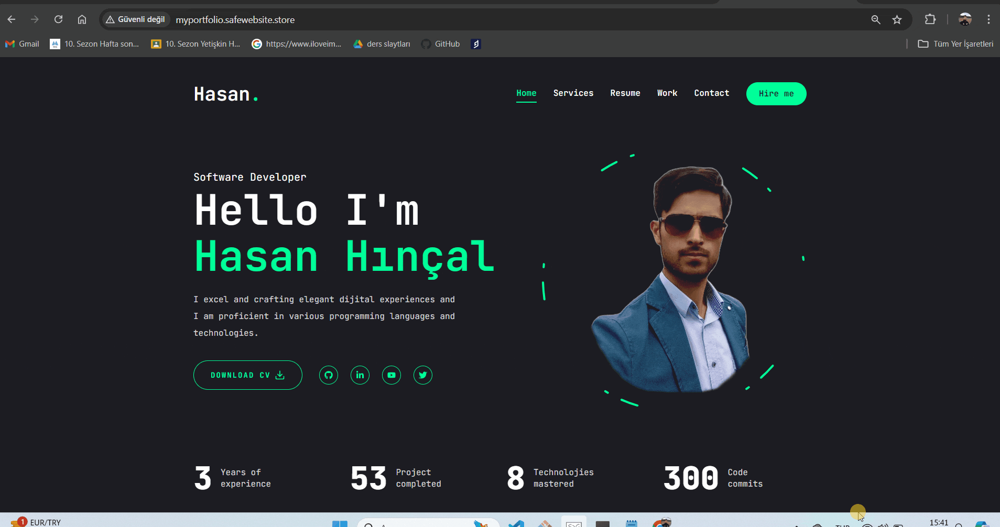

# My Portfolio

A modern and responsive portfolio website built with Next.js, Tailwind CSS, and a collection of other powerful libraries. This project showcases my skills, experience, and the work I have done as a Frontend Developer.

## 🚀 Technologies Used

- **Next.js** (v14.2.7): A React framework that enables server-side rendering and generating static websites for React based web applications.
- **React** (v18): A JavaScript library for building user interfaces.
- **Tailwind CSS** (v3.4.1): A utility-first CSS framework for rapidly building custom user interfaces.
- **Framer Motion** (v11.3.30): A popular library for animations and gestures in React.
- **Swiper** (v11.1.12): A modern touch slider used for creating responsive carousels.
- **Radix UI**: A set of accessible and unstyled components for building modern UIs.
  - `@radix-ui/react-dialog`
  - `@radix-ui/react-scroll-area`
  - `@radix-ui/react-select`
  - `@radix-ui/react-slot`
  - `@radix-ui/react-tabs`
  - `@radix-ui/react-tooltip`
- **React Icons** (v5.3.0): A library for including popular icons in your project as React components.
- **Lucide-react** (v0.436.0): A beautiful set of icons to enhance UI/UX.
- **Tailwind Merge** (v2.5.2): A utility for combining classes in Tailwind CSS.
- **Class Variance Authority** (v0.7.0): A library for handling conditional class names in a simpler way.
- **Clsx** (v2.1.1): A utility for constructing `className` strings conditionally.
- **React CountUp** (v6.5.3): A React component wrapper around CountUp.js, which can be used to create animations that display changing numbers.

## 🌟 Features

- **Responsive Design:** Fully responsive layout that works on all devices.
- **Modern UI/UX:** Clean and modern user interface design with smooth animations.
- **Dynamic Content:** Integration of dynamic content and data showcasing my skills, experience, and projects.
- **Interactive Components:** Usage of Radix UI components for accessible and interactive UI elements.
- **Animated Elements:** Implementation of animations using Framer Motion for a smooth and engaging user experience.

## For Live Project

http://www.myportfolio.safewebsite.store/

## 📸 Project Gif

## 🤝 Contributing

If you'd like to contribute, please fork the repository and use a feature branch. Pull requests are warmly welcome.
